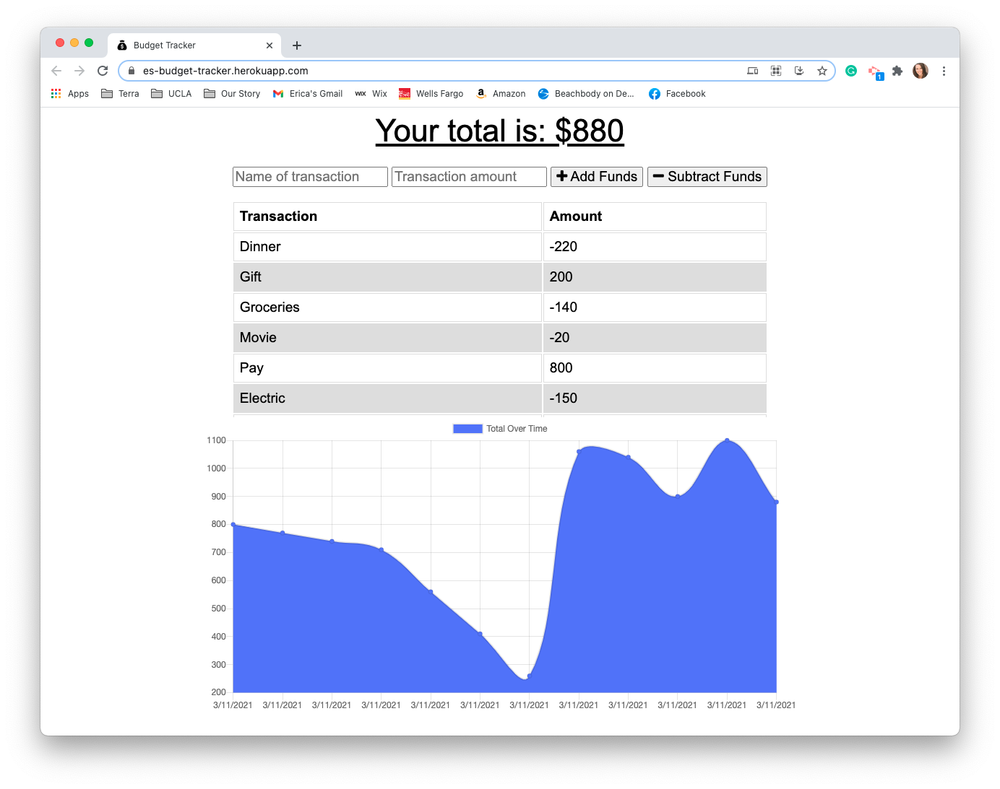

# Budget Tracker 

 
## Description
The Budget Tracker is a PWA app. Using a Budget Tracker that was already created, it has been updated to have offline functionality in the event that there is no internet connection. It is also a PWA App that can be downloaded.

If the user does not have an internet connection they will still be able to add elements of their budget to the page. The data is then stored in indexedDB in their browser. When offline, the user can refresh the page and the cached pages will be available for the user to still add budget data. When the user is able to connect to the internet, the data stored in indexedDB will be uploaded to the api and stored for the user.

## Table of Contents
  
* [Description](#description)
* [Features](#features)
* [Languages](#languages)
* [Links](#link)
* [Usage](#usage)
* [Screenshots](#screenshots)

## Features
    
- User Interface
- Create a Budget
- Add and subtract dollar ammounts that is added to a graph
- When offline user can still see the site and update their budget data
- The Data is then stored in their browser and will be uploaded when they reconnect to the internet.

## Languages

JavaScript, HTML, CSS, Node, Mongoose, MongoDB

## Links 

[Budget Tracker Deployed Page](https://es-budget-tracker.herokuapp.com/)

[Budget Tracker GitHub](https://github.com/ericasiegel/budget-tracker.git)

## Usage

This Budget Tracker allows the user to import their budget data online and offline. When offline, the data will be saved until it can be uploaded to the api when the user is back online.

## Screenshots
    
### Main Page

### Offline Cached Data View

### Offline Saved Data

### Successful Upload When Online

### PWA

## Credits

- [Node.js](https://nodejs.org/en/)
- [MongoDB](https://www.mongodb.com/3)
- [Mongoose](https://mongoosejs.com/docs)
    